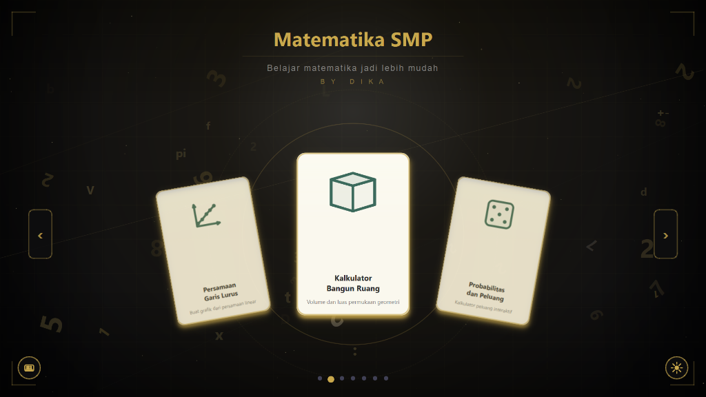

<div align="center">
  <h1>Junior High School Mathematics Calculator</h1>
  <p><b>A lightweight and interactive application to help verify assignments and mathematical problems for Junior High School level.</b></p>
  <br>
  <p>
    
    
    
    <a href="https://github.com/hihihehadika/kalkulator-matematika-smp/releases/latest">
      
    </a>
  </p>
</div>

---

## About the Application

**Junior High School Mathematics Calculator** is a desktop software designed to easily find answers for various types of math problems. The application was originally built using Python (PyQt6) as a prototype, and then entirely rewritten using **C++** to be more highly optimized, lightweight in memory, and with smoother animations.

> **Note:** The application's user interface and built-in formulas are currently presented in **Indonesian**.

With a modern user interface (carousel style) and interactive 3D visual geometry, this application aims to be an engaging companion for solving math homework.

---

## Main Features

<div align="center">
  
</div>

This application provides 7 calculation calculation modules, each with its own specific visualizations:

1. **3D Geometry (Bangun Ruang)** 
   Calculate Volume and Surface Area, complete with a *Reverse Solving* feature (finding side lengths if the volume is known). Equipped with **Interactive 3D Visualizations (Wireframe/Solid)** for 8 major geometric shapes (Cube, Cylinder, Cone, Pyramid, etc.) that can be manipulated with auto-rotation.

2. **Linear Equations (Persamaan Garis Lurus)**
   Determine gradients, find equations through 2 coordinates (X and Y), and features automatic Cartesian line plotting.

3. **Probability (Peluang & Probabilitas)** 
   Calculate event probabilities. Displays special visualizers for Coin tosses, Dice rolls, and a complete Sample Space table.

4. **Linear Equation Systems (SPLDV)**
   Features an Elimination method calculation algorithm to find the solution set for two variables flawlessly.

5. **Pythagorean Theorem**
   High decimal precision to find the hypotenuse, base, or perpendicular height of a right-angled triangle.

6. **Basic Statistics**
   Freely input a numerical dataset to instantly get the computed Mean, Median, and Mode.

7. **Basic Calculator**
   A supplementary feature offering a standard integrated calculation screen for daily arithmetic needs.

---

<br>

<div align="center">

## Download Installer (.exe)

For those who want to directly install and try the application, please easily download the latest version by clicking the button below:

[](https://github.com/hihihehadika/kalkulator-matematika-smp/releases/latest)

</div>

<br>

---

## Build from Source (For Developers)

For developers who wish to compile the code on their local machine:

#### Prerequisites:
* `C++17` Compiler (MinGW 64-bit is highly recommended for Windows)
* **CMake** (version 3.16 or higher)
* **Qt 6 OpenSource** standard library (main components: `Core`, `Gui`, `Widgets`, `Charts`, `Qml`)

#### Build Steps:
Run the following standard CMake commands from your terminal's working directory. 

> **Important:** If your compiler cannot automatically detect Qt6, you need to point CMake to your Qt installation directory using the `-DCMAKE_PREFIX_PATH` flag during the configuration step.

```bash
git clone https://github.com/hihihehadika/kalkulator-matematika-smp.git
cd kalkulator-matematika-smp
mkdir build && cd build

# 1. Configure the project (adjust the Qt path according to your local machine)
cmake -DCMAKE_PREFIX_PATH="C:/Qt/6.x.x/mingw_64" ..

# 2. Build the executable
cmake --build .
```

---
*Created by Dika.*
